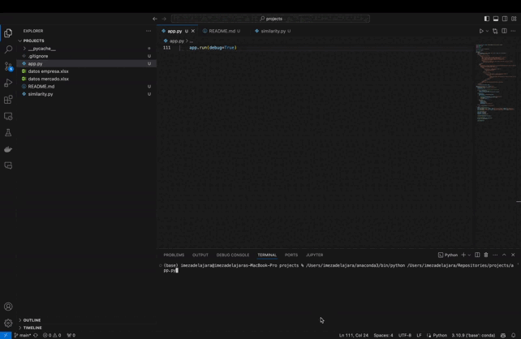

# 🤗 Similitud de Productos 🤗


Este repositorio contiene una API diseñada para comparar productos que tienen nombres similares utilizando el algoritmo `TF-IDF`. Además, integra una aplicación desarrollada en `Flask` que permite a los usuarios depurar manualmente los 5 productos más similares a un producto de referencia. Es importante destacar que este código realiza comparaciones entre dos conjuntos de datos: una base de referencia y una secundaria.

## Cómo ejecutar

Ejecutar el código es muy sencillo. Solo necesitas iniciar la API de Flask con el siguiente comando:

```bash
python app.py
```

## Ejemplo de Funcionamiento

### Legacy


### New Comparator


